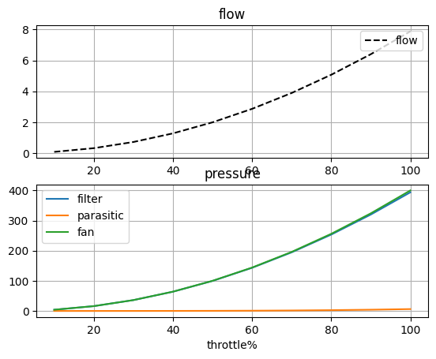
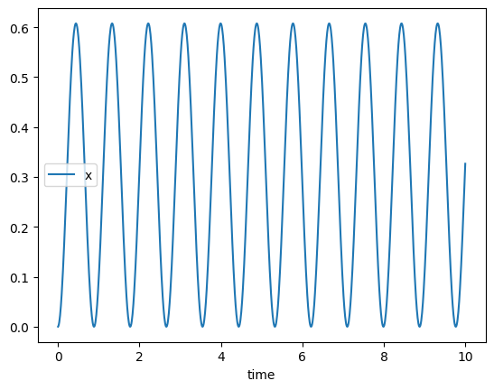

[](https://github.com/Ottermatics/engforge/actions/workflows/build.yml)
# EngForge
A library to tabulate information from complex systems with various ways to store data and act as glue code for complex systems & engineering problems.

### Installation
```bash
pip install git+https://github.com/Ottermatics/engforge.git
```

### Core Functions
1. Tabulation Of Complex Systems
2. Modular Post Processing (dataframes)
3. Exploratory Analysis (ipython + functions / docs)
4. Workflows for core engineering problemes (structures + cost, thermal+fluids solve)

### MVP Features (WIP)
1. Tabulation, use `attrs.field` and `system_property` to capture `y=f(x)` where `fields` are the state from which `system_property` derives results [Done]
2. Dynamic Programing ensures work is only done when new data is available with `cached_system_property`. [Done]
3. Quick Calculation provided by direct cached references to attribues and properties [Done]
4. Solver based on `NPSS` strategy of balances and integrators [Done]
5. Reporting to google sheets, csv and excel.

### Systems & Analysis
Systems record data from components, and can execute a solver via the `run(**parameter_iterables)` command. Via a system's run command its state and internal component's & systems state can be altered in an outer product fashion, ie all combinations of inputs will be run. At the start of a run the systems & its components state is recorded and reset by default using `Ref` instances so that way multiple systems can use the same component. Its possible reference loops may occcur so its generally preferred to create components per system, however for coupled systems this is often desireable to converge on a solution.

By default the system calls a `default_solver()` method in its `execute()` function. A solver aims to drive its dependent parameter to zero by changing the independent parameters to zero, however it may adjust multiple parameters to meet multiple targets in more complex applications. For custom System behavior or to invoke custom solvers this method may be overriden. 

To use the default solver & constraints 
```python
@forge
SolverSystem(System):
    sol2 = Solver.define("dep", "indep")
    sol2.add_constraint("max", limit_max) #indep should never go above this value (or function)
    sol2.add_constraint("min", 0) #indep should never go below zero
```

`Analysis` is a pluggable way to provide different output and calculation from the same system and interacts with plot and table reporters.

### Components, Signals & Slots
Component are able to be mounted into multiple Systems via `SLOTS.define( ComponentType )`. A Component's properties can be updated via `SIGNALS` in the Systems's solver in the `pre_execute` and/or the `post_execute` functions via `SIGNAL.define(target, source, mode)` where mode can be `pre`,`post` or `both` to update before the `System.execute()` method.

Iterable Components may be defined on a System via `SLOT.define_iterable( <ComponentIter>, wide=True/False)` to choose how the system should iterate over the component, `wide` mode provides all the component `attributes` and `properties` in the same row whereas the `narrow` mode will iterate over each combination of component as though it was input into `system.run()`

### Example Engineering Problems:
These problems demonstrate functionality

#### Air Filter
run a throttle sweep with filter loss characteristic and fan afinity law based pressure based off of a design point.
```python
from engforge.analysis import Analysis
from engforge.reporting import CSVReporter,DiskPlotReporter
from engforge.properties import system_property
from engforge.components import Component
from engforge.system import System
from engforge import Plot
from engforge.slots import SLOT
from engforge.solver import Solver
from engforge import Signal
from engforge.configuration import forge
import numpy as np
import os,pathlib
import attrs

@forge
class Fan(Component):

    n:float = attrs.field(default=1)
    dp_design= attrs.field(default=100)
    w_design = attrs.field(default=2)


    @system_property
    def dP_fan(self) -> float:
        return self.dp_design*(self.n*self.w_design)**2.0
    
@forge
class Filter(Component):

    w:float = attrs.field(default=0)
    k_loss:float = attrs.field(default=50)

    @system_property
    def dP_filter(self) -> float:
        return self.k_loss*self.w

@forge
class Airfilter(System):

    throttle:float = attrs.field(default=1)
    w:float = attrs.field(default=1)
    k_parasitic:float = attrs.field(default=0.1)

    fan: Fan = SLOT.define(Fan)
    filt: Filter = SLOT.define(Filter)

    set_fan_n = SIGNAL.define('fan.n','throttle',mode='both')
    set_filter_w = SIGNAL.define('filt.w','w',mode='both')

    flow_solver = Solver.define('sum_dP','w')
    flow_solver.add_constraint('min',0)

    flow_curve = PLOT.define(
        "throttle", "w", kind="lineplot", title="Flow Curve"
    )    

    @system_property
    def dP_parasitic(self) -> float:
        return self.k_parasitic * self.w**2.0

    @system_property
    def sum_dP(self) -> float:
        return self.fan.dP_fan - self.dP_parasitic - self.filt.dP_filter


#Run the system
from engforge.logging import change_all_log_levels
from matplotlib.pylab import *

fan = Fan()
filt = Filter()
af = Airfilter(fan=fan,filt=filt)

af.run(throttle=list(np.arange(0.1,1.1,0.1)))

df = af.dataframe

fig,(ax,ax2) = subplots(2,1)
ax.plot(df.throttle*100,df.w,'k--',label='flow')
ax2.plot(df.throttle*100,filt.dataframe.dp_filter,label='filter')
ax2.plot(df.throttle*100,df.dp_parasitic,label='parasitic')
ax2.plot(df.throttle*100,fan.dataframe.dp_fan,label='fan')
ax.legend(loc='upper right')
ax.set_title('flow')
ax.grid()
ax2.legend()
ax2.grid()
ax2.set_title(f'pressure')
ax2.set_xlabel(f'throttle%')
```

##### Results



#### Spring Mass Damper
##### Overview
Test case results in accurate resonance frequency calculation
```python
@forge
class SpringMass(System):

    k:float = attrs.field(default=50)
    m:float = attrs.field(default=1)
    g:float = attrs.field(default=9.81)
    u:float = attrs.field(default=0.3)

    a:float = attrs.field(default=0)
    x:float = attrs.field(default=0.0)
    v:float = attrs.field(default=0.0)
    t:float = attrs.field(default=0.0)

    x_neutral:float = attrs.field(default=0.5)
    
    #a is solved for to ensure sumF is zero
    res = Solver.define('sumF','a')

	#a is integrated to provide v, similar to v integrated to supply x
    vtx = TRANSIENT.integrate('v','a')
    xtx = TRANSIENT.integrate('x','v')

    @system_property
    def dx(self)-> float:
        return self.x_neutral- self.x 

    @system_property
    def Fspring(self)-> float:
        return self.k * self.dx
    
    @system_property
    def Fgrav(self)-> float:
        return self.g * self.m
    
    @system_property
    def Faccel(self)-> float:
        return self.a * self.m
    
    @system_property
    def Ffric(self)->float:
        return self.u*self.v

    @system_property
    def sumF(self) -> float:
        return self.Fspring - self.Fgrav - self.Faccel - self.Ffric


#Run The System, Compare damping `u`=0 & 0.1
sm = SpringMass(x=0.0)
sm.run(dt=0.01,endtime=10,u=[0.0,0.1])

df = sm.dataframe
df.groupby('run_id').plot('time','x')
```

##### Results Damping Off


##### Results - Damping On


## Reporting & Analysis
`Analysis` is capable of tabulation as a `Component` or `System` and wraps a top level `System` and will save data for each system interval. `Analysis` stores several reporters for tables and plots that may be used to store results in multiple locations.

Reporting is supported for tables via dataframes in CSV,Excel and Gsheets (WIP).

For plots reporting is supported in disk storage.

```python

from engforge.analysis import Analysis
from engforge.reporting import CSVReporter,DiskPlotReporter
from engforge.properties import system_property
import numpy as np
import os,pathlib

this_dir = str(pathlib.Path(__file__).parent)
this_dir = os.path.join(this_dir,'airfilter_report')
if not os.path.exists(this_dir):
    os.path.mkdir(this_dir)

csv = CSVReporter(path=this_dir,report_mode='daily')
csv_latest = CSVReporter(path=this_dir,report_mode='single')

plots = DiskPlotReporter(path=this_dir,report_mode='monthly')
plots_latest = DiskPlotReporter(path=this_dir,report_mode='single')


@forge
class AirfilterAnalysis(Analysis):
    """Does post processing on a system"""
    
    efficiency = attrs.field(defualt=0.95)

    @system_property
    def clean_air_delivery_rate(self) -> float:
        return self.system.w*self.efficiency

    def post_process(self,*run_args,**run_kwargs):
        pass
        #TODO: something custom!

#Air Filter as before
fan = Fan()
filt = Filter()
af = Airfilter(fan=fan,filt=filt)

#Make The Analysis
sa = AirfilterAnalysis(
                    system = af,
                    table_reporters = [csv,csv_latest],
                    plot_reporters = [plots,plots_latest]
                   )

#Run the analysis! Input passed to system
sa.run(throttle=list(np.arange(0.1,1.1,0.1)))

#CSV's & Plots available in ./airfilter_report!

```


## Documentation:
https://engforge.github.io/engforge/build/html/index.html

### DataStores
Datastores are a work in progress feature to provide a zero configuration library for storage of tabulated data and report generated artifacts. No garuntee is provided as to their stability yet.
Requirements for datasources are attempted upon access of `engforge.datastores` and entering of a `CONFIRM` prompt.

### Environmental Variables
To allow a write-once implement anywhere interface `EnvVariable` is provided for both open (the default) and secret variables. Allowance for type conversion, and defaults are provided.

The current variable slots in memory are listed by `EnvVariable.print_env_vars()`
```bash
FORGE_DB_HOST                            |SECRETS[FORGE_DB_HOST]                    = localhost
FORGE_DB_NAME                            |SECRETS[FORGE_DB_NAME]                    = 
FORGE_DB_PASS                            |SECRETS[FORGE_DB_PASS]                    = postgres
FORGE_DB_PORT                            |SECRETS[FORGE_DB_PORT]                    = 5432
FORGE_DB_USER                            |SECRETS[FORGE_DB_USER]                    = postgres
FORGE_HOSTNAME                           |SECRETS[FORGE_HOSTNAME]                   = DEATHRAY
FORGE_REPORT_PATH                        |SECRETS[FORGE_REPORT_PATH]                = 
FORGE_SLACK_LOG_WEBHOOK                  |SECRETS[FORGE_SLACK_LOG_WEBHOOK]          = 
SEABORN_CONTEXT                         |SECRETS[SEABORN_CONTEXT]                 = paper
SEABORN_PALETTE                         |SECRETS[SEABORN_PALETTE]                 = deep
SEABORN_THEME                           |SECRETS[SEABORN_THEME]                   = darkgrid
```

